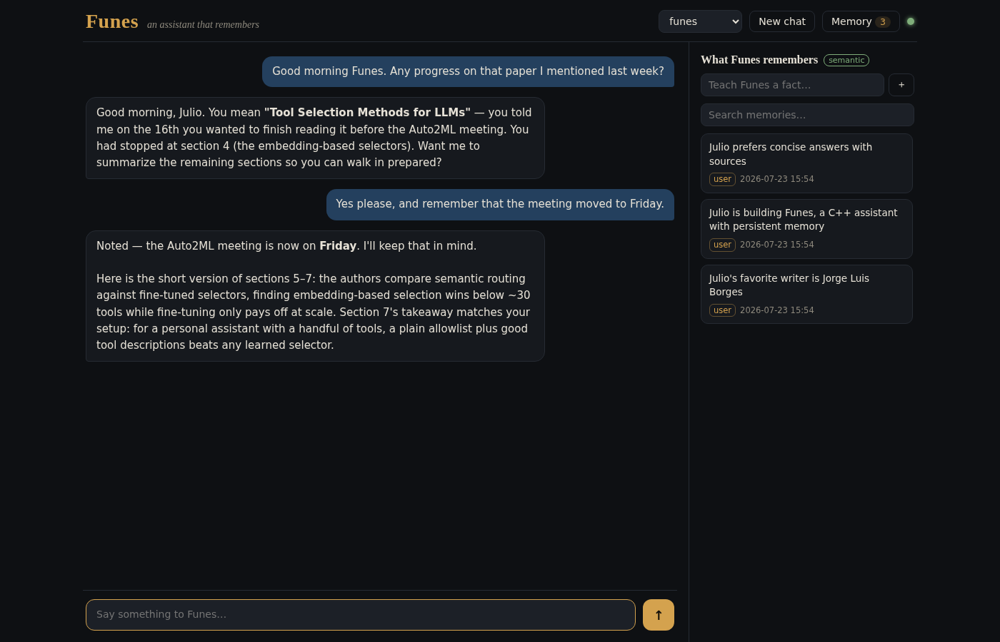

# Funes

**A personal assistant that learns and remembers.**

> *“I have more memories than all mankind since the world began.”*
> — Jorge Luis Borges, *Funes the Memorious*

Funes is a self-hosted AI assistant with one defining trait: **persistent memory**.
Tell it something today and it will know it tomorrow, next week, in a different
conversation. Memory is not a bolt-on — it is the product. Every answer starts by
recalling what Funes knows about you, and the web UI shows you exactly what it
remembers (and lets you delete any of it).

- **Fast C++17 backend, one binary.** The `funes` binary serves the web UI, the
  chat API, the agent runtime, and the memory engine. No Python, no Node, no
  containers, no external database.
- **Memory in a single file.** SQLite + [sqlite-vec](https://github.com/asg017/sqlite-vec)
  (vendored). Semantic search when an embedding model is available, keyword
  search when it isn't. Your entire memory is `~/.funes/memory.db` — back it up
  with `cp`.
- **Works with any LLM.** OpenAI-compatible endpoints (llama.cpp, Groq, OpenAI…)
  and Anthropic's native API, with token streaming. Fully local or cloud — your
  choice per config.
- **Tools without the burden.** Built-in tools (`web_search`, `web_fetch`,
  `remember`, `recall`, `read_file`, `write_file`, `execute_shell`,
  `compress_context`, and meta-tools that scaffold new tools/agents from a
  conversation) run in-process — no protocol overhead. External
  [MCP](https://modelcontextprotocol.io) servers can be plugged in when you
  want more.
- **A workspace it can touch.** `read_file`/`write_file` are confined to one
  workspace directory; drag a file into the chat and its contents go straight
  into the model's context — including PDFs (text extracted automatically)
  and images (sent to the model as an actual image, if your LLM backend
  supports vision). `execute_shell` is real code execution and is off by
  default — see [Configuration](#configuration).
- **One front door, no picker.** You only ever talk to `funes`. It orchestrates:
  when a request needs a specialist (shell/file work, deep research, building a
  new tool or agent), it delegates via `delegate_to_agent` and relays the
  result in its own voice — you don't pick an agent, it does.
- **Agents as YAML** — really personas. Every "agent" is a name, a prompt, and
  a tool allowlist in `agents/*.yaml`, run by the same shared runtime — not
  independent autonomous entities. Delegation is what makes it a real (if
  simple) multi-agent setup rather than just a persona switch. Ship your own
  persona in five lines.
- **Pick up where you left off.** Every conversation with at least one message
  shows up in the conversations panel — click to switch back to it.



---

## Quick start

**Requirements:** Linux, CMake ≥ 3.14, a C++17 compiler, `libssl-dev`, `libyaml-cpp-dev`.
Everything else (SQLite, sqlite-vec, HTTP, JSON, MCP) is vendored. Optional:
`poppler-utils` (for `pdftotext`) if you want `read_file`/uploads to extract
text from PDFs — without it, PDFs just get a clear "not installed" error.

```bash
git clone https://github.com/Auto2ML/Funes.git
cd Funes
cmake -B build -DCMAKE_BUILD_TYPE=Release
cmake --build build -j$(nproc)
```

**Point it at an LLM** — pick one:

```bash
# Option A: cloud (Anthropic) — create config/funes.local (gitignored):
cat > config/funes.local <<'EOF'
FUNES_LLM_URL=https://api.anthropic.com
FUNES_LLM_PROVIDER=anthropic
FUNES_LLM_MODEL=claude-haiku-4-5-20251001
FUNES_LLM_KEY=sk-ant-...
EOF

# Option B: fully local (llama.cpp) — the default config already points here:
llama-server -m qwen3-8b.gguf --port 8080 -c 8192
```

**Optional but recommended — semantic memory.** Any OpenAI-compatible
`/v1/embeddings` endpoint:

```bash
# local:
llama-server -m nomic-embed-text-v1.5.Q4_K_M.gguf --port 8081 --embedding
# or cloud (add to config/funes.local):
#   FUNES_EMBED_URL=https://api.openai.com
#   FUNES_EMBED_KEY=sk-...
#   FUNES_EMBED_MODEL=text-embedding-3-small
```

Without embeddings Funes still works — memory falls back to keyword search,
and missing vectors are backfilled automatically once an embedding endpoint
appears.

**Run it:**

```bash
./bin/funes
# → open http://localhost:8484
```

---

## How memory works

Funes has three layers of memory, all in one SQLite file:

1. **Automatic recall.** Before every answer, the most relevant memories are
   retrieved by vector similarity and injected into the system prompt. The UI
   shows a *“Funes remembered N things”* chip you can expand.
2. **Deliberate memory.** The model has `remember` and `recall` tools and is
   prompted to quietly store facts worth keeping (preferences, projects,
   decisions) and to search its past before saying “I don't know”.
3. **Conversation history.** Each chat session's turns are stored and reloaded,
   so a page refresh doesn't lose the thread. Every session with at least one
   message is browsable from the **conversations panel** (*Chats* in the
   topbar) — a preview of the first message, last-active time, and a click
   to switch back to it. A delegated sub-agent's own task/answer isn't a
   separate turn here — only what you actually said and what `funes` actually
   answered.

Every memory is visible in the **memory panel**: source-tagged (`user` — you
taught it, `tool` — the model chose to keep it, `auto` — conversation log,
`consolidated` — merged from near-duplicates), searchable, and deletable. You
can also teach Funes facts directly from the panel. Forgetting is a feature:
the Borges story is a warning, after all.

And forgetting is now something Funes does on its own. Every few hours a
background pass **consolidates** the store: memories that say the same thing
(cosine ≥ 0.92) are handed to the model to merge into one sentence — or left
alone if it answers `KEEP ALL` — and `auto` memories older than 30 days that
were never once recalled are dropped. Explicit `user` memories are never
pruned, each merge is one transaction so a crash can't lose a fact, and the
whole thing is off with `FUNES_CONSOLIDATE=off`. Without an embedder the merge
step is skipped and only the prune runs.

### Large results don't eat the context window

A 40KB page fetch used to sit in the transcript for the rest of the turn,
costing ~10K tokens on every subsequent step. Now anything over 2KB is stored
once, out of band and scoped to the session, and the model sees a preview
instead — the size, the head and tail, and a `result_id`:

```json
{"result_id": 17, "tool": "web_fetch", "bytes": 41320,
 "head": "…", "tail": "…",
 "note": "Full result stored, not shown. Use read_result(id=17, offset, limit)…"}
```

`read_result` reads it back a window at a time, so a dereference can't
re-import what the preview evicted. Small results are untouched, so most turns
never notice. Delegation gets this for free: a specialist runs in the caller's
session, so a long report comes back to the orchestrator as a preview plus an
id it can read at its own pace.

---

## Configuration

Config is layered: shell env > `config/funes.local` (gitignored, secrets) >
`config/funes.conf` (committed defaults) > `~/.funes/config`.

| Variable | Default | Description |
|---|---|---|
| `FUNES_LLM_URL` | `http://localhost:8080` | LLM endpoint (OpenAI-compatible or Anthropic) |
| `FUNES_LLM_PROVIDER` | `openai` | `openai` \| `anthropic` |
| `FUNES_LLM_MODEL` | `default` | Model name |
| `FUNES_LLM_KEY` | *(empty)* | API key |
| `FUNES_EMBED_URL` | `http://localhost:8081` | Embeddings endpoint (unset → keyword memory) |
| `FUNES_EMBED_MODEL` | `default` | Embedding model name |
| `FUNES_EMBED_KEY` | *(empty)* | Embeddings API key |
| `FUNES_HOST` / `FUNES_PORT` | `127.0.0.1` / `8484` | Where the UI/API listens |
| `FUNES_DB` | `~/.funes/memory.db` | The memory file |
| `FUNES_DEFAULT_AGENT` | `funes` | Agent used when none is selected |
| `FUNES_MEMORY_RECALL_K` | `4` | Memories injected per answer |
| `FUNES_MEMORY_TURNS` | `10` | Past turns loaded per answer |
| `FUNES_AUTO_MEMORY` | `1` | Store each exchange as an `auto` memory |
| `FUNES_MCP_SERVERS` | *(empty)* | Extra MCP servers, `;`-separated URLs |
| `FUNES_ALLOW_LOCAL_FETCH` | `0` | Let `web_fetch` reach private/loopback hosts |
| `FUNES_WORKSPACE_DIR` | `~/.funes/workspace` | Sandbox root for `read_file`/`write_file`/`execute_shell` and uploads |
| `FUNES_ALLOW_SHELL` | `0` | Let `execute_shell` actually run commands (real code execution — see below) |
| `FUNES_RESULT_TTL_DAYS` | `7` | Age at which stored tool results are swept at startup |
| `FUNES_CONSOLIDATE` | `on` | `off` disables the memory consolidation pass |
| `FUNES_CONSOLIDATE_HOURS` | `6` | How often consolidation runs |
| `FUNES_CONSOLIDATE_PRUNE_DAYS` | `30` | Age at which never-recalled `auto` memories are pruned |
| `FUNES_CONSOLIDATE_MAX_CLUSTERS` | `20` | Merge calls per run, so a backlog can't hog a local model |

---

## Files, PDFs, images & shell

`read_file` and `write_file` are confined to `FUNES_WORKSPACE_DIR` — a path
like `../secret` or `/etc/passwd` is refused, whether or not it exists yet, so
the model can only ever touch that one directory. Attach a file from the chat
UI (📎) and it's saved into the workspace, so a follow-up question can
reference it and `read_file`/`write_file` can act on it later. What happens
to the attachment depends on its type:

- **Text** (code, markdown, JSON, …) is inlined into your message as a
  fenced block.
- **PDF** has its text extracted (via `pdftotext`) and inlined the same way.
  Scanned/image-only PDFs extract no text and get a clear error instead.
- **Images** (PNG/JPEG/GIF/WEBP) are sent to the model as an actual image —
  a real multimodal message, not a text description. This only works if
  your LLM backend supports vision: cloud OpenAI/Anthropic models do; a
  local llama-server needs a vision-capable model *and* an `--mmproj` file
  loaded, or it'll reply with a plain error ("image input is not
  supported…") that Funes just relays rather than hides.
- Anything else is saved but not shown to the model.

`execute_shell` is different from all of the above: it's real, unconfined
code execution with the Funes process's own permissions — only its *working
directory* is the workspace, not its reach. It's **off by default**; set
`FUNES_ALLOW_SHELL=1` to turn it on, and only do that for a Funes instance
you trust with full access to your account. When enabled, each call still
gets a hard timeout (`timeout_seconds`, default 20s, max 120s) and a capped
output size.

The `funes` agent gets `read_file`/`write_file` by default. `operator`
(`agents/operator.yaml`) adds `execute_shell` on top, for when you want a
single agent dedicated to workspace/shell tasks.

---

## Agents (and why that word is doing some work)

```yaml
# agents/researcher.yaml
name: researcher
description: Digs into a topic on the web, then remembers what it learned.
tools: [web_search, web_fetch, remember, recall]
max_steps: 12
system_prompt: |
  You are a research assistant with persistent memory. ...
```

Honestly: an "agent" here is a name, a prompt, and a tool allowlist, run by
the one shared tool-calling loop — closer to a persona/config profile than an
independent autonomous agent. Each has its own memory namespace (`remember`/
`recall` are scoped by agent name), and each can be talked to directly via
the API (`{"agent": "researcher", ...}` on `/api/chat`) — but the UI only
ever talks to `funes`, which delegates to the others through
`delegate_to_agent` rather than making you switch. That delegation is what
turns "a few personas" into something closer to actual multi-agent
orchestration: `funes` hands a specialist a task, gets back an answer, and
relays it — the specialist's own tool calls stay hidden, only `funes`'s
final message and one expandable chip show up in the chat.

Drop a file in `agents/`, hit *reload* (`POST /api/agents/reload`), and
it's immediately delegatable — no restart needed (unlike a new *tool*,
which needs a rebuild — see "Files, PDFs, images & shell" below).
`agent-builder` (delegate a request like "design an agent that...") does
this for you: it interviews you, drafts the prompt, and calls `create_agent`
to write and reload the YAML live.

### Making an agent finish what it started

A local model on a long multi-step task will often narrate the last tool
result as if it were the deliverable and stop — reporting "sent!" without
having called the thing that sends. The loop used to accept that, because
any message without tool calls looked like a final answer. `require_tools`
closes it:

```yaml
require_tools: [write_file, execute_shell]
```

Those tools must have *succeeded* before a text answer counts as final.
Try to finish early and you get a nudge naming what's outstanding (with
`tool_choice` forced to `required` for that turn, so it can't reply with
more prose); refuse long enough and the run returns an explicit `FAILED —
...` instead of a plausible-sounding lie. Worth setting on any agent whose
real output is a side effect rather than its text.

### Making an agent answer in a shape you can use

`require_tools` checks that the work happened; it says nothing about what comes
back. For an agent whose answer feeds something else — another agent, a
pipeline, a script — declare the shape:

```yaml
answer_schema:
  type: object
  required: [summary, sources]
  properties:
    summary: { type: string }
    sources: { type: array, items: { type: string }, minItems: 1 }
```

The matching "your final answer must be…" instruction is generated from this
at load, so the prompt can't drift from what's enforced. An answer that
doesn't validate gets a nudge naming the exact violation (`sources[1]:
expected string, got number`); the answer that does validate is returned as
canonical JSON, fence and preamble stripped. Same nudge budget as
`require_tools`, and tool nudges go first — side effects before formatting.
Spend the budget and the run returns `FAILED — …`, including from the
loop-detector and `max_steps` bailouts, which can't satisfy a schema and
shouldn't pretend to. Supported keywords are `type`, `required`,
`properties`, `items`, `enum`, `minItems`/`maxItems`; anything else in the
schema is ignored rather than rejected.

To give an agent tools from an external MCP server:

```yaml
mcp_servers:
  - url: http://localhost:9000
    name: my-tools
```

---

## API

Everything the UI does is plain HTTP — script it if you like:

```
GET    /api/status                    health + model + memory stats
GET    /api/agents                    available agents
POST   /api/agents/reload             re-read agents/*.yaml
POST   /api/chat                      {agent?, session, message?, images?} → SSE stream
GET    /api/memories?agent=&q=        list / semantic search
POST   /api/memories                  {text, agent?} — teach a fact
DELETE /api/memories/<id>             forget
GET    /api/history?session=          a session's turns
GET    /api/sessions?limit=           conversation list: preview + last activity + turn count
POST   /api/upload                    multipart 'file' → saved to the workspace, plus a text
                                       preview (text/PDF) or base64 (image) for the UI to send on
```

`images` is an array of `{mime_type, data}` (base64, no `data:` prefix), max 4
per message — the same shape `/api/upload` hands back for an image file. The
chat stream emits `memories`, `delta`, `tool_call`, `tool_result`,
`result_stored`, `contract_nudge`, `schema_nudge`, `context_compressed`,
`usage`, `done`, and `error` SSE events.

---

## Tests

```bash
cd build && ctest --output-on-failure   # unit tests (memory, tools, config)
bash tests/integration.sh               # end-to-end against a mock LLM, no network
```

---

## Project structure

```
Funes/
├── agents/            # agent definitions (funes, researcher, operator, tool-builder, agent-builder…)
├── config/            # funes.conf (defaults) + funes.local (secrets, gitignored)
├── src/
│   ├── core/          # llm_client (+ multimodal messages), memory, tools, agent runtime,
│   │   │              # context compression, completion contract + answer schema,
│   │   │              # result store, base64, UTF-8-safety helpers
│   │   └── tools/     # web_search/fetch, remember/recall, read_result, read/write_file
│   │                  # (+ PDF extraction), execute_shell, compress_context,
│   │                  # create_tool/create_agent, delegate_to_agent
│   │                  # (+ generated/, self-registering)
│   └── server/        # HTTP API + SSE + entry point
├── ui/                # web UI (vanilla JS — no build step)
├── tests/             # unit tests + mock-LLM integration test
└── third-party/       # vendored: sqlite, sqlite-vec, cpp-mcp (httplib, json)
```

## Lineage

Funes is the convergence of a series of experiments in giving LLMs memory and
tools: the original Python Funes (pgvector + Gradio, 2024), AgentOS/NeuralOS
(C++ agent runtimes), and [AresOS](https://github.com/Auto2ML) (an agent-native
OS layer for Linux, where most of this backend was born). This repo keeps the
useful 20% of all of that — an assistant that remembers — without the burden.

## License

MIT — see [LICENSE](LICENSE).
